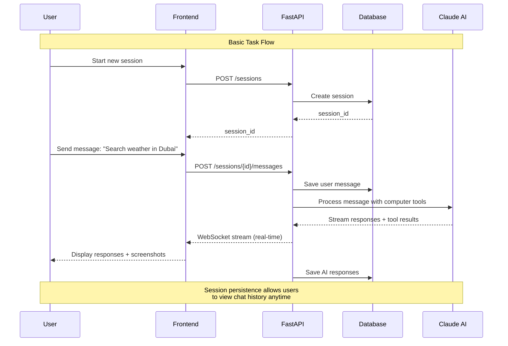

### Author: Rauf Asadov (github: rasadov)
### Video: https://youtu.be/ZRuawC35XsA
# Computer Use Demo Backend

A FastAPI-based backend for the Anthropic Computer Use Demo with persistent session management, real-time streaming, and a modern web interface. This application allows Claude to interact with a virtual desktop environment through a RESTful API with WebSocket support.

## Features

- **Persistent Session Management**: Sessions and chat history stored in PostgreSQL
- **Real-time Communication**: WebSocket support for live updates from Claude
- **Modern Web Interface**: Integrated VNC viewer with chat interface
- **Redis Integration**: Connection management and real-time session tracking
- **Docker Compose Setup**: One-command deployment with all dependencies
- **Claude 4 Support**: Latest Claude 4 Sonnet and Opus models supported

## Quick Start

### Prerequisites

- Docker and Docker Compose
- Anthropic API Key

### Setup

1. **Clone and configure environment**:
   ```bash
   git clone <repository-url>
   cd computer-use-demo
   cp .env.example .env
   ```

2. **Add your Anthropic API key to `.env`**:
   ```env
   ANTHROPIC_API_KEY=your_anthropic_api_key_here
   POSTGRES_USER=user
   POSTGRES_PASSWORD=password
   POSTGRES_DB=computer_use
   POSTGRES_PORT=5432
   DEBUG=false
   ```

3. **Start the application**:
   ```bash
   docker compose up -d --build
   ```

4. **Access the application**:
   - **Main Interface**: http://localhost:8000
   - **API Documentation**: http://localhost:8000/docs

## Architecture

### System Flow Diagram



### Services

- **FastAPI Backend** (`localhost:8000`): RESTful API with WebSocket support
- **PostgreSQL Database** (`localhost:5432`): Session and message persistence
- **Redis** (`localhost:6379`): Real-time connection management
- **VNC Desktop** (`localhost:5900`): Virtual desktop environment
- **noVNC Web Client** (`localhost:6080`): Web-based VNC access

### Key Components

```
app/
├── api/                    # API routes and WebSocket handlers
├── models/                 # Database models (sessions, messages)
├── repositories/           # Data access layer
├── services/              # Business logic and AI processing
└── utils/                 # Utilities and converters

computer_use_demo/         # Original Anthropic computer use tools
frontend/                  # Web interface files
```

## API Endpoints

### Sessions
- `POST /api/v1/sessions` - Create new session
- `GET /api/v1/sessions` - List all sessions
- `GET /api/v1/sessions/{id}` - Get session details

### Messages
- `POST /api/v1/sessions/{id}/messages` - Send message to Claude
- `WS /api/v1/sessions/{id}/ws` - WebSocket for real-time updates

### Health
- `GET /api/v1/sessions/health/redis` - Redis connection status

## Usage

### Creating a New Task Session

1. Click "Start New Agent Task" in the web interface
2. Enter your task description in the chat input
3. Watch Claude interact with the desktop environment in real-time
4. View tool outputs and screenshots as they happen

### Example Tasks

- "Open Firefox and search for information about Python"
- "Create a text document and write a summary of today's weather"
- "Take a screenshot of the desktop and describe what you see"
- "Install a software package using the terminal"

## Configuration

### Environment Variables

| Variable | Description | Default |
|----------|-------------|---------|
| `ANTHROPIC_API_KEY` | Anthropic API key | Required |
| `POSTGRES_SERVER` | PostgreSQL host | `localhost` |
| `POSTGRES_USER` | Database user | `user` |
| `POSTGRES_PASSWORD` | Database password | `password` |
| `POSTGRES_DB` | Database name | `computer_use` |
| `POSTGRES_PORT` | Database port | `5432` |
| `REDIS_URL` | Redis connection URL | `redis://localhost:6379` |
| `DEBUG` | Enable debug mode | `false` |

### Desktop Environment

- **Resolution**: 1024x768 (configurable via `WIDTH`/`HEIGHT`)
- **Display**: Virtual X11 display with window manager
- **VNC Port**: 5900 (accessible via noVNC on port 6080)

## Database Schema

### Sessions Table
```sql
CREATE TABLE sessions (
    id VARCHAR(255) PRIMARY KEY,
    created_at TIMESTAMP DEFAULT CURRENT_TIMESTAMP,
    updated_at TIMESTAMP DEFAULT CURRENT_TIMESTAMP,
    status VARCHAR(255) DEFAULT 'active',
    metadata JSON DEFAULT '{}'
);
```

### Messages Table
```sql
CREATE TABLE chat_messages (
    id VARCHAR(255) PRIMARY KEY,
    session_id VARCHAR(255) REFERENCES sessions(id),
    role VARCHAR(255) NOT NULL,
    content JSON NOT NULL,
    timestamp TIMESTAMP DEFAULT CURRENT_TIMESTAMP,
    message_type VARCHAR(255) DEFAULT 'text'
);
```

## WebSocket Events

The WebSocket connection provides real-time updates:

```javascript
{
  "role": "assistant",
  "content": { "type": "text", "text": "I'll help you with that task." }
}

{
  "role": "tool_result", 
  "content": { "base64_image": "...", "output": "Screenshot taken" }
}

```

## Security Considerations

⚠️ **Important Security Notes**:

- This demo runs Claude with access to a virtual desktop environment
- Only use with trusted tasks and avoid sensitive data
- The application is designed for development and demonstration purposes
- Consider network isolation and access controls for production use

## Troubleshooting

### Common Issues

1. **Docker Build Fails**:
   ```bash
   docker compose down -v
   docker compose up -d --build --force-recreate
   ```

2. **Database Connection Issues**:
   ```bash
   docker compose logs db
   docker compose restart db
   ```

3. **WebSocket Connection Problems**:
   ```bash
   docker compose logs redis
   docker compose restart redis
   ```

4. **VNC Display Issues**:
   ```bash
   docker compose exec app ./start_all.sh
   ```

### Logs

```bash
# View all service logs
docker compose logs -f

# View specific service logs
docker compose logs -f app
docker compose logs -f db
docker compose logs -f redis
```

## License

This project is licensed under the MIT License. See [LICENSE](LICENSE) for details.

## Acknowledgments

- Built on the [Anthropic Computer Use Demo](https://github.com/anthropics/anthropic-quickstarts)
- Uses Claude 4 models for advanced computer interaction capabilities
- Integrates with Anthropic's computer use tools and APIs